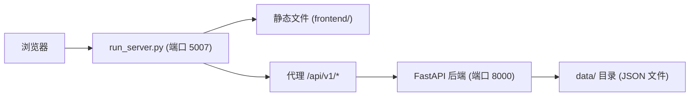

## 1. 架构设计

纯前端 SPA（Single Page Application），通过 Proxy 服务器与后端 API 通信。



## 2. 技术说明

- **前端**: 纯 HTML + CSS + JavaScript（零框架，零外部依赖）
- **服务端**: Python http.server（内置模块），`run_server.py` 同时代理 API 请求
- **数据源**: 后端 FastAPI（http://localhost:8000），通过 `run_server.py` 自动代理 `/api/` 请求
- **无需构建工具**：直接运行 `python run_server.py` 即可

## 3. 路由定义

前端为单页应用，通过 URL hash 实现客户端路由：

| 路由 | 功能 |
|------|------|
| `#/` | 看板概览 |
| `#/static/{category}` | 静态分析详情（functions/globals/types/interrupts/registers/state_machines） |
| `#/static/call_graph` | 静态调用图 |
| `#/binary/{category}` | 二进制分析详情（functions/globals/types） |
| `#/binary/call_graph` | 二进制调用图 |
| `#/modeling/{name}` | 建模报告 |
| `#/sym_execution` | 符号执行报告 |

## 4. 文件结构

```
frontend/
├── index.html          # 主页面（SPA 入口）
├── css/
│   └── style.css       # 全部样式
├── js/
│   ├── api.js          # API 客户端（fetch 封装）
│   ├── app.js          # 路由 + 页面渲染逻辑
│   └── components.js   # 可复用组件（表格、卡片、调用图）
├── features/           # 预留特性目录
└── img/                # 预留图片目录
```

## 5. 数据流

1. `index.html` 加载 → `app.js` 初始化路由监听
2. URL hash 变化 → `app.js` 调用 `api.js` 拉取对应数据
3. `api.js` → `fetch("/api/v1/{namespace}/{resource}")` → 通过代理到后端
4. 数据返回 → `components.js` 渲染视图 → 插入 DOM
5. 所有数据只读，前端不写回

## 6. API 端点映射

| 前端视图 | API 端点 |
|----------|----------|
| 看板统计 | 依次 fetch 各分类计数 |
| 静态函数 | `/api/v1/static/functions` |
| 静态调用图 | `/api/v1/static/call_graph` |
| 二进制函数 | `/api/v1/binary/functions` |
| 二进制调用图 | `/api/v1/binary/call_graph` |
| 建模安全报告 | `/api/v1/modeling/security_report` |
| 符号执行报告 | `/api/v1/sym_execution/report` |